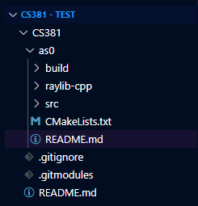

# PROJECT README

This is a repository containing all assignments for CS381. Each folder following the format 'asX' such as (as0, as1, and so on) each contain on its own an assignment completed for the course. Each folder has their own seperate more specific readme, and it is recommended to follow those. However, the following generally applies to the contents of each folder. 

## INSTRUCTIONs

### DEPENDENCIES

To run this project on most systems, including WSL, ensure you have the following dependencies listed in the following command (or just run it :p)...

```bash
sudo apt get-update # updates sudo
sudo apt install cmake g++ libgl-dev libwayland-dev wayland-protocols libxrandr-dev pkg-config libxkbcommon-dev libxinerama-dev libxcursor-dev libxi-dev mesa-utils build-essential cmake xorg-dev pulseaudio
sudo apt --fix-broken install # should fill any missing dependencies
```

### CLONING THE REPOSITORY

You can normally clone the repository, but doing so will incur some extra work to be done for fetching submodules. If you don't want to do that, use the following commands in your target directory...

```bash
git clone --recurse-submodules https://github.com/PieFlavr/CS381
```

Now, your folder structure shoould look similar to this...



### [OPTIONAL] FETCHING SUBMODULEs

If you cloned the repository normally without `--recurse-submodules` or there are issues with the submodules, they must be fetched manually.
To fetch them manually, from the main directory run the following...

```bash
git submodule add https://github.com/joshuadahlunr/raylib-cpp.git
git submodule init
git submodule update --init --recursive
```

### COMPILING CODE

In order, from the main repository directory (../CS381/), simply run the following commands in the terminal...
*(replace 'asX' with the assignment folder name in question)*

```bash
cd <'asX'>/build   # Only run if not already in build directory
cmake ..   # Generates makefile + fixes dependencies
make   # Generates as0 executable, must run everytime code is changed.
```

`[OPTIONAL]` If running into a wayland-related error during `cmake`, go into `CMakeCache.txt` and set this setting to OFF `GLFW_BUILD_WAYLAND:BOOL=OFF`.
This may or may not disable *window decorations*, but by default without the above modification they should be visible and enabled.

### RUNNING CODE

To run the code after compilation, simply run the `asX` executable from the `../asX/build/` directory via
*(replace 'asX' with the assignment folder name in question)*

```bash
cd <'asX'>/build    # Only run if not already in build directory
./as1   # Runs program executable
```

### [OPTIONAL] BUILD/RUNNING ERRORs

If unable to compile, run, or getting errors with regards to directories/pathing, it is recommended you delete the contents of the `build` folder and re-compile the code. Make sure to run this from the main directory!!!
*(replace 'asX' with the assignment folder name in question)*

```bash
cd <'asX'>/build    # Only run if not already in build directory
rm -rf ./*   # Runs program executable
```

## WSL Problems & Solutions

### Audio Issues

While it should already be covered by the dependencies, refer to this if audio issues occur.

Raylib audio (theoretically) works perfectly fine inside of WSL itself, but the issue comes with piping the audio from WSL to the outer Windows computer. This is easily solved via the use of PulseAudio. Using the following solves any theoretical issues running this otherwise...

```bash
sudo apt get-update #usually not updated enough to handle
sudo apt install pulseaudio
```

If any further issues are encountered with playing/manipulation audio, refer to `pulseaudio` for attempted solutions.
