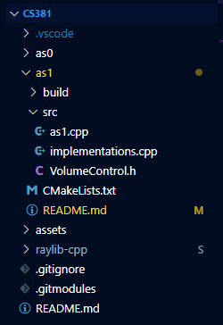
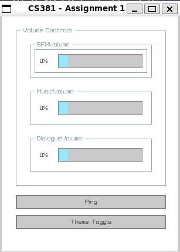
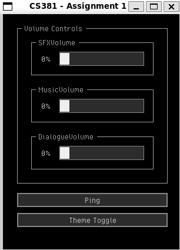

# AS1 README

## INSTRUCTIONs [FEATURE \#7 (9 pts)]

### DEPENDENCIES

To run this project on most systems, including WSL, ensure you have the following dependencies listed in the following command (or just run it :p)...

```bash
sudo apt get-update # updates sudo
sudo apt install cmake g++ libgl-dev libwayland-dev wayland-protocols libxrandr-dev pkg-config libxkbcommon-dev libxinerama-dev libxcursor-dev libxi-dev mesa-utils build-essential cmake xorg-dev pulseaudio
sudo apt --fix-broken install # should fill any missing dependencies
```

### CLONING THE REPOSITORY

You can normally clone the repository, but doing so will incur some extra work to be done for fetching submodules. If you don't want to do that, use the following commands in your target directory...

```bash
git clone --recurse-submodules https://github.com/PieFlavr/CS381
```

Now, your folder structure shoould look similar to this...



### [OPTIONAL] FETCHING SUBMODULEs

If you cloned the repository normally without `--recurse-submodules` or there are issues with the submodules, they must be fetched manually.
To fetch them manually, from the main directory run the following...

```bash
git submodule add https://github.com/joshuadahlunr/raylib-cpp.git
git submodule init
git submodule update --init --recursive
```

### COMPILING THE CODE

In order, from the main repository directory (../CS381/), simply run the following commands in the terminal...

```bash
cd as1/build   # Only run if not already in build directory
cmake ..   # Generates makefile + fixes dependencies
make   # Generates as0 executable, must run everytime code is changed.
```

`[OPTIONAL]` If running into a wayland-related error during `cmake`, go into `CMakeCache.txt` and set this setting to OFF `GLFW_BUILD_WAYLAND:BOOL=OFF`.
This may or may not disable *window decorations*, but by default without the above modification they should be visible and enabled.

### RUNNING THE CODE

To run the code after compilation, simply run the `as1` executable from the `../as1/build/` directory via...

```bash
cd as1/build    # Only run if not already in build directory
./as1   # Runs program executable
```

### [OPTIONAL] BUILD/RUNNING ERRORs

If unable to compile, run, or getting errors with regards to directories/pathing, it is recommended you delete the contents of the `build` folder and re-compile the code. Make sure to run this from the main directory!!!

```bash
cd as1/build    # Only run if not already in build directory
rm -rf ./*   # Runs program executable
```

## APPLICATION CONTROLs

Controlling the application is very simple.
Pressing `[TAB]` will highlight a volume slider, and pressing it again will cycle through each slider. The highlight should look as follows...
(left = light mode ; right = dark mode)

   

To change the highlighted volume slider, simply press the `[LEFT]` arrow key to decrease volume or `[RIGHT]` to increase it. 

You can simply `[LEFT_CLICK]` on the `PING` button with your mouse to play a sound effect (affected by SFX Volume).
To change the theme appearance, you just `[LEFT_CLICK]` on the `THEME TOGGLE` button,

## QUIZ QUESTIONs and ANSWERs [FEATURE \#8 (10 pts)]

The following are the answer to the quiz questions required for the assignment.

**(1) Explain at a high level how audio is produced by a speaker. Why is the raylib::AudioDevice necessary in your code? (10 pts)**

At a high level, the speaker produces audio by converting electrical signals to vibrations/oscillations in the air that we interpret as sound. The waveform of the electrical signal controls the speaker device generating these vibrations, whether that speaker is essentially just a diaphragm, solenoid, or otherwise. 

When playing a piece of audio such as an .mp3 or .wav, samples or even chunks of samples are sent to the speaker. For smaller more immediate sound bites (SFX), these can be loaded into RAM for speed, but longer files (Music) they can be streamed from the disk to the RAM instead in chunks. Either way, they are sent to the speaker. 

From looking at the terminal messages, the `raylib::AudioDevice` is necessary in the code because this essentially sets up the audio engine and resource management needed to actually play the audio. Without it, we would essentially be attempting to play audio without an interface to actually manipulate the speaker. 