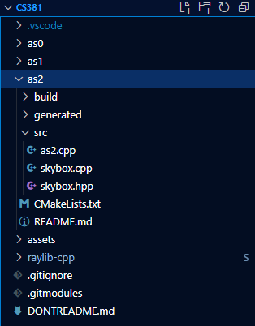

# as2 README

## PREFACE

This project is likely structured slightly differently than similar projects. The following are key important details:
* There is a deliberate pre-existing empty (with exception of .gitkeep) `build` folder in each assignment folder.
* All assets folders and submodules such as `raylib-cpp` exist in the main directory (there are no copies per assignment directory).
* The ENTIRE repository must be cloned to work. 
* While there are redundancies for if the bash commands are run from the `MAIN` repository, you should generally run them in the 'as2' folder.
* All testing of commands were done in WSL on Windows 11 on different devices and with fresh repository clones. 

Additionally, all instructions are made with the following assumptions:
* The user starts in the assignment (`../as2` or otherwise) directory.
* The user already has most dependencies installed.
* The user has (by default) cloned the repository normally. 

## INSTRUCTIONs [FEATURE \#11 (4 pts)]

### [OPTIONAL] DEPENDENCIES

To run this project on most systems, including WSL, ensure you have the following dependencies listed in the following command (or just run it :p)...

```bash
sudo apt get-update # updates sudo
sudo apt install cmake g++ libgl-dev libwayland-dev wayland-protocols libxrandr-dev pkg-config libxkbcommon-dev libxinerama-dev libxcursor-dev libxi-dev mesa-utils build-essential cmake xorg-dev pulseaudio
sudo apt --fix-broken install # should fill any missing dependencies
```

### [OPTIONAL] RECURSIVELY CLONING THE REPOSITORY

You can normally clone the repository, but doing so will incur some extra work to be done for fetching submodules. If you don't want to do that, use the following commands in your target directory...

```bash
git clone --recurse-submodules https://github.com/PieFlavr/CS381
```

Now, your folder structure should look similar to this...



### FETCHING SUBMODULEs

If you cloned the repository normally without `--recurse-submodules` or there are issues with the submodules, they must be fetched manually.
To fetch them manually, from the assignment directory (`../as2`), run ALL the following...

```bash
git submodule init 
git submodule update --init --recursive 
```

### COMPILING THE CODE

In order, either from the main (`../build`) or assignment (`../as2`) repository directory, simply run ALL following commands in the terminal...

```bash
cd as2 ; cd build # Works from main/assignmnent/build folds. IGNORE ERRORS FROM THIS!!!
cmake ..   # Generates makefile + fixes dependencies
make   # Generates as2 executable, must run every time code is changed.
```

`[OPTIONAL]` If running into a wayland-related error during `cmake`, go into `CMakeCache.txt` and set this setting to OFF `GLFW_BUILD_WAYLAND:BOOL=OFF`.
This may or may not disable *window decorations*, but by default without the above modification they should be visible and enabled.

### RUNNING THE CODE

To run the code after compilation, simply run the `as2` executable from the `../build/` directory via running ALL the following commands...

```bash
./as2   # Runs program executable
```

### [OPTIONAL] BUILD/RUNNING ERRORs

If unable to compile, run, or getting errors with regards to directories/pathing, it is recommended you delete the contents of the `build` folder and re-compile the code. Make sure you are in the BUILD directory of the assignment (command accounts for that but still be careful)!!!

```bash
cd as2 ; cd build # Should work from main, assignment, or build directory... IGNORE ERRORS FROM THIS (accounts for being in either main/assignment/build directory)
rm -rf ./*   # Deletes the contents of the build folder
```

Additionally, if receivng a `DRIVER TIMOUT` or some sort of `DRIVER CRASH`, it is recommended to simply restart your computer to fix it along with the above.

## APPLICATION CONTROLs

Simply `[LEFT_CLICK]` to toggle all extra credit features (including wheels, spinning, animations, etc.)

## QUIZ QUESTIONs and ANSWERs [FEATURE \#12 (5 pts)]

The following are the answer to the quiz questions required for the assignment.

**(1) QUESTION #1**

*(1A) What is the point of the DrawBoundedModel function?*

The DrawBoundedModel() function draws the model with the associated matrix transformations provided via arguments.
The matrix transformations are not permanent, and the model's initial transform matrix is saved and then set back after drawing.
Additionally, it draws the wireframe BoundingBox of the model, which is essentially the smallest box encompassing it. 
The BoundingBox is useful considering not all models are so perfectly visible, as well as for showing collision and other similar logics. Although given that this is only the apparent "draw" of the model as opposed to the the actual permanenet transform, such logic is likely to be implemented seperately while this function is utilized for visual aid of said logic. 
Given this is also only the apparent "draw" of the model, you can perform this multiple times with the same model, effectively being able to see multiple of the same model without taking on the additional overhead of loading identical models for different draws. 

*(1B) Could this function be used in the future to set transformations when a model is loaded?*

Since the function does not make permanent changes to the model's transform matrix, you can not set permanent transform modifications on model load. You would need to explicitly modify the model's transform via a function or otherwise to obtain permanent changes. You can use this function to make temporary changes while drawing the model. 

*(1C) Could it be used to transform a model relative to some "parent"?*

Because of how matrix transformations work and the fact lambdas are passed to transform, you could absolutely use this function to transform a model relative to a "parent". While certain transformations are non-commutative and order matters heavily, all you would realistically need to do is to "chain" matrix transformations while accounting for the hierarchy. Applying the "parent" model transforms, and then the "child" model's transformations relative to the "parent" (by modifying references axes or otherwise) can accomplish this behavior. 

With the way I implemented it though, the logical order appears "backwards" (applying child transforms and then parents), though this is more a consequence of not how coordinate transforms working "backwards" in Linear Algebra (right-to-left application).

## EXTRA CREDIT FEATURE IMPLEMENTATIONs

The following have been implemented in the program...

1) Custom Internet Meshes (5 points)
2) Animate Models (5 points)
3) Four Wheels that Move Along (5 points)
4) Appropriately Ambient Audio (5 points)

In the source code `as2.cpp` you can [CTRL+F] and type "EC Feature" to see all primary implementations of the above.